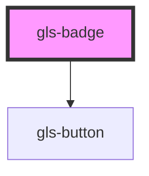

# gls-badge

<!-- Auto Generated Below -->

## Properties

| Property        | Attribute         | Description | Type     | Default  |
| --------------- | ----------------- | ----------- | -------- | -------- |
| `badgeColor`    | `badge-color`     |             | `string` | `'#f91'` |
| `badgeContent`  | `badge-content`   |             | `string` | `'323'`  |
| `badgeHostText` | `badge-host-text` |             | `string` | `'按钮'`   |
| `badgeStyle`    | `badge-style`     |             | `string` | `''`     |

## Dependencies

### Depends on

- [gls-button](../gls-button)

### Graph

----------------------------------------------

*Built with [StencilJS](https://stenciljs.com/)*
