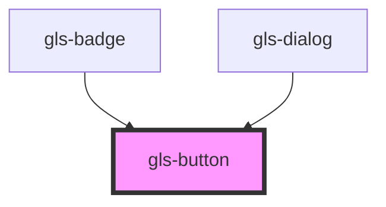

# gls-button

<!-- Auto Generated Below -->

## Properties

| Property       | Attribute       | Description                                             | Type     | Default      |
| -------------- | --------------- | ------------------------------------------------------- | -------- | ------------ |
| `buttonRadius` | `button-radius` | 设置 button 边框圆角的大小                              | `string` | `'3px'`      |
| `buttonText`   | `button-text`   | 内部文本                                                | `string` | `'默认文字'` |
| `buttonType`   | `button-type`   | 按钮风格，支持 [default,primary,success,warning,danger] | `string` | `'default'`  |

## Dependencies

### Used by

- [gls-badge](../gls-badge)
- [gls-dialog](../gls-dialog)

### Graph

---

_Built with [StencilJS](https://stenciljs.com/)_
