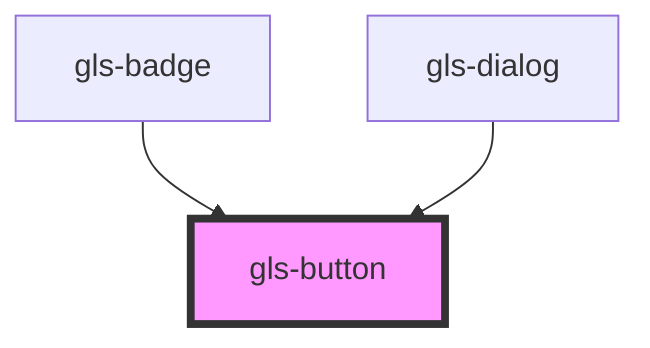

# gls-button

<!-- Auto Generated Below -->

## Properties

| Property       | Attribute       | Description | Type     | Default     |
| -------------- | --------------- | ----------- | -------- | ----------- |
| `buttonRadius` | `button-radius` |             | `string` | `'3px'`     |
| `buttonSize`   | `button-size`   |             | `string` | `'medium'`  |
| `buttonText`   | `button-text`   |             | `string` | `'默认文字'`    |
| `buttonType`   | `button-type`   |             | `string` | `'default'` |

## Events

| Event           | Description | Type                  |
| --------------- | ----------- | --------------------- |
| `buttonClicked` |             | `CustomEvent<Object>` |

## Methods

### `changeState(index: number) => Promise<void>`

#### Returns

Type: `Promise<void>`

## Dependencies

### Used by

 - [gls-badge](../gls-badge)
 - [gls-dialog](../gls-dialog)

### Graph

----------------------------------------------

*Built with [StencilJS](https://stenciljs.com/)*
