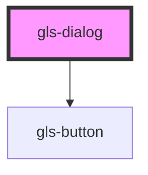

# gls-dialog

<!-- Auto Generated Below -->

## Properties

| Property | Attribute | Description | Type     | Default                    |
| -------- | --------- | ----------- | -------- | -------------------------- |
| `deliverdata`  | --        |      默认emit的数据      | `object` | `{     a: 1,     b: 2   }` |

## Events

| Event                 | Description | Type                  |
| --------------------- | ----------- | --------------------- |
| `newDataSubmitted` |             | `CustomEvent<Object>` |

## Methods

### `closeDialog() => Promise<void>`

#### Returns

Type: `Promise<void>`

确认/取消按钮关闭改对话框

### `showDialog() => Promise<void>`

#### Returns

Type: `Promise<void>`

触发对话框显示的函数

## Dependencies

### Depends on

- [gls-button](../gls-button)

### Graph

----------------------------------------------

*Built with [StencilJS](https://stenciljs.com/)*
