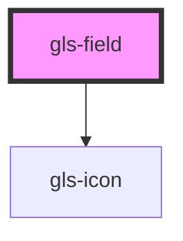

# gls-field

<!-- Auto Generated Below -->

## Properties

| Property    | Attribute    | Description | Type      | Default   |
| ----------- | ------------ | ----------- | --------- | --------- |
| `inputIcon` | `input-icon` |             | `string`  | `''`      |
| `inputText` | `input-text` |             | `string`  | `'请在此输入'` |
| `labelText` | `label-text` |             | `string`  | `'默认文本'`  |
| `required`  | `required`   |             | `boolean` | `false`   |

## Dependencies

### Depends on

- [gls-icon](../gls-icon)

### Graph

----------------------------------------------

*Built with [StencilJS](https://stenciljs.com/)*
