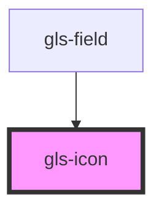

# gls-icon

<!-- Auto Generated Below -->

## Properties

| Property    | Attribute    | Description | Type     | Default      |
| ----------- | ------------ | ----------- | -------- | ------------ |
| `iconColor` | `icon-color` |             | `string` | `'#fff'`     |
| `iconSize`  | `icon-size`  |             | `string` | `'25px'`     |
| `iconStyle` | `icon-style` |             | `string` | `'&#xe61e;'` |

## Dependencies

### Used by

 - [gls-field](../gls-field)

### Graph

----------------------------------------------

*Built with [StencilJS](https://stenciljs.com/)*
